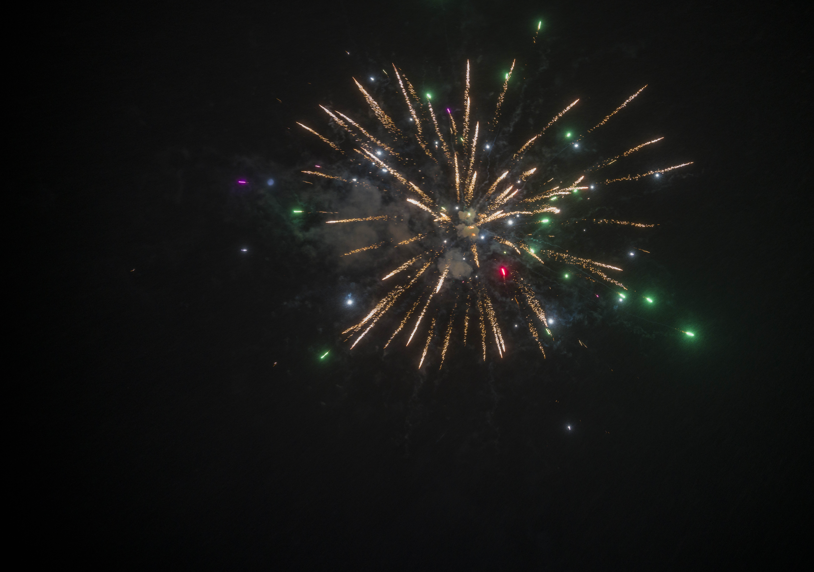
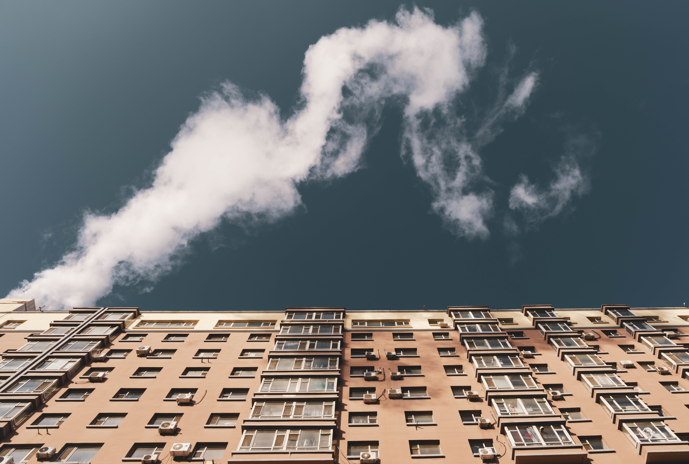
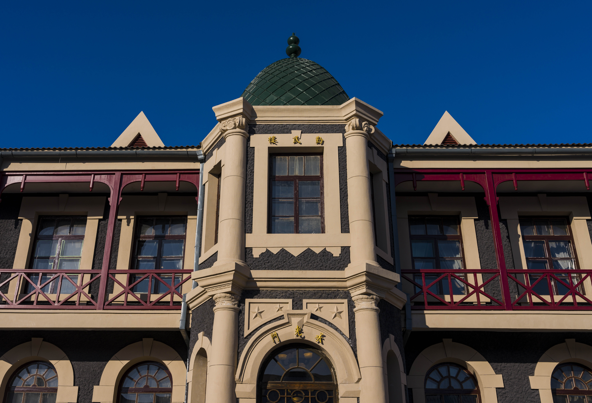
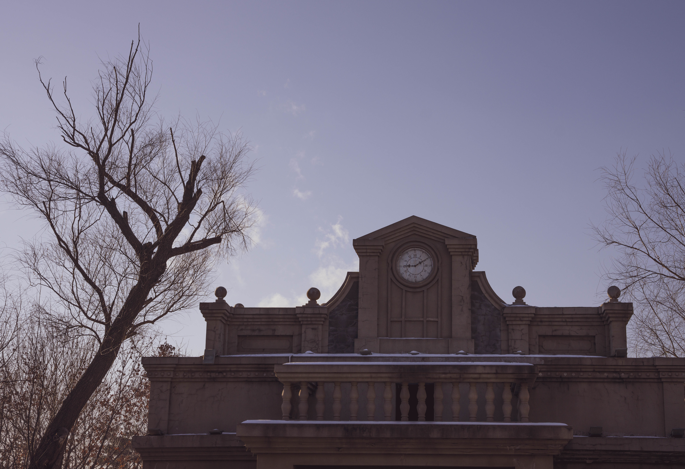

# 长白山 - 欧皇之旅
**引子：**
圣诞节前后大概有个5天的小长假，我就寻思可以去哪儿玩，感觉去东北这个假期长度应该刚好。然后就约了几个公司的小伙伴一起出去旅游，还看了其他地方，看了冬天还是去长白山看景+滑雪+温泉舒服。然后很快就决定了，最后一行有7个人。

## 筹备：
### 防寒
东北的天气还是真的冷，不能不信邪觉得自己很抗冻。我因为之前没有秋衣秋裤这种东西，去优衣库买了三件球衣和两件秋裤。可惜买了两件女式的秋裤，不知道哪个素质差的把女士秋裤放到了男士区。。。唉，临行前一天还没发去换，最后又带上川藏线上借同事的秋裤，只此一条。
还有因为要滑雪的原因，需要穿的活动度大一点的保暖衣服，因为我的冲锋衣不好塞羽绒内胆，不得已又补了一件冲锋衣，冲锋衣加羽绒内胆真的yyds，全程就靠这个，除了在天池上有点小冷。上衣的配置的话，就是保暖内衣+羽绒内胆+冲锋衣，可能是我不太怕冷，需要的话还得加一件摇粒绒。
帽子一定要，可以在迪卡侬买滑雪那种雷锋帽，基本一步到位够用了。手套的话最好五指手套，厚一点，稍微可以防点水就好，因为要滑雪。
### 滑雪装备
我们很多装备是直接在雪场租的，自己只买了副滑雪眼镜，如果专业的话我看有人会专门准备一套滑雪服，我看有很多买的那种看上去一点不臃肿的滑雪服，肯能是为了拍照好看吧。

其他的话，因为去的地方都是城市，也不需要特意准备，并不像西藏那样，还是可以在当地买到不错的。

## Day 0
第一天我们都约在龙阳路见面，可以直接磁悬浮到浦东机场。早饭就在龙阳路地铁站的麦当劳解决了。

为什么说这是欧皇之旅，因为从赶飞机的时候，就已经是运气爆棚才能赶上，我们吃麦当劳似乎吃的有点磨蹭，最后一路小跑才刚刚好赶上飞机。不得不说，浦东机场太大了，你到了机场还要做接驳地铁去登机口，还是要多预留点时间，1个小时吧。

大概下我们就到了长春啦，长春给我的第一个感觉就是好像来到了贾樟柯的电影里，感觉时间被拉回去10年，远方的烟囱还在冒着水汽，我们到东北了。

晚上还准备去网吧小玩一下，发现也没啥玩的。最后吃了顿烤肉，烤肉真的可以，烤肉比脸还大，最后人均也就100出头。然后又去打了会儿桌球，桌球室里人还挺多，大声聊天的也挺多，我们慢慢说话都有了点东北口音。打完桌球我们去超市买了点东西晚上吃，和第二天在路上用。

# Day1
第一天我们就坐大巴去长白山啦，去我们老早定的度假酒店。

中午我们就到了长白山度假区，这里有万达和我们定的鲁能两个酒店，万达好像滑雪场高级点，但是住的没有鲁能好。中午我们在万达旁边吃了午饭，大概都中规中矩，没有啥特别好吃的菜。不过我点了个手擀面，给我上的像是粗的挂面，有点不开心了。

吃完就打车去酒店了，瑞士风的酒店，里面还包滑雪票。一个房间3晚4000块，挺贵的但是房间还可以。特别是我们仨男的搞了个亲子房，里面还有桌子，这下晚上的桌游有地方了。

因为到的时候天还不晚，我们就酒店前面的雪地玩了好一会儿，有一点小斜坡，可以租那种小滑板滑下去。附图我同事的茕茕孑立。

晚上在酒店吃的自助，着实是一般，菜的种类和口味都偏差，有机会还是打车去别的饭店吃，都还可以。吃完饭我们买了些啤酒，放在酒店外冰镇，然后开始打牌～

## Day 2
天池开放都是随时的，随时关随时开，因为对天池的向往。我们房间三个人一大早就打车去了南门。可惜最后还是没开，就回酒店和他们一起滑雪。

因为天池还没开放，我们就在酒店的雪场滑雪。其实初学者划一划就会了，当然得有老手来教一教基本动作，因为我之前在克利夫兰滑过，发现肌肉记忆还在，很快就到了中级雪道，鲁能的雪道没有万达的多，但是也可以滑一天了。没有特别难的，滑雪发烧友建议还是得去别的雪场。

滑雪～
滑雪～
滑雪～

晚上我们找了家吃食，大众点评上找的，价格有点小贵，大概人均一百大几。但是吃的还可以，不知道是不是饿了的原因，不管是火锅还是东北菜都是上桌秒光，吃饭还得抢，有点大学的时候聚会的感觉了。不过一起来的东北人觉得不是太地道。

### Day 3

转眼已经第三天了，天池还是没有开放，伴随着灰色的心情继续去一些周边景点玩一玩，司机推荐了一个漂流，还挺贵的，100多一个人，实在是没啥意思，就是在河上往下漂，然后雾凇也要一定条件才有，也没看到，要天气足够冷，那天的天气不是太冷。漂流水的温度大概在5度左右，漂的时候会给你大
衣，不是太冷。漂流店里的小金毛还蛮乖巧，给它拍了几张照。

漂流大概就这样。

漂流完了之后，司机大哥突然传来好消息，天池北区开了。我们赶紧上车，驱车前往长白山。这真的是欧皇之旅，据说来长白山能看到天池的真不多。

第一个景点当然是天池，在景区门口租了羽绒长袍+雪地靴+护膝，这些真的需要，不然山上的带着冰碴子的风真的扛不住。

不知道倒了几趟车，最后坐了一个景区的吉普车，因为山上的路其他车都不好开，然后走一小段路就可以到。

天池上的风非常大，带着从雪山上吹过来的冰晶，裸露在外面的皮肤会很不舒服，所以建议面罩啥的都得带上。然后天池也没啥可看的，就是个冰坨坨，还想看到天池水怪也没有😂。

风里面的冰屑也很多，搞得自动对焦很难对焦上，但拍出来发现别有韵味。

然后是一个记不得名字的景点，又被冻住的瀑布和小湖泊。这地方有很多雪，我们在这里打了很久的雪仗，引来路人羡慕（嫌弃）的眼光。

然后到了一个山峰下，恍然有点像优胜美地。

一路走～

整个白天都是在山上走，然后天黑了才回到酒店，在隔壁县城某家店吃了烤肉，还买了烟花，准备晚上放。。。

买了有大概500块，但是半小时就放完了。。。烟花真的是烧钱。

## Day 4
今天是闲逛的一天，我们在长春闲逛一天。

主要目标只有一个 - 伪满洲皇宫。

早上的长春还是冷，路上人也不多。感觉建筑风格都是21世纪初的风格，很老派，很多地方会有水蒸气，有点蒸汽朋克🧐🧐。

走个二十多分钟就到了，溥仪的皇宫 - 伪满洲皇宫博物馆。

说实话，溥仪的私人barber shop还是帅的，非常羡慕。

主色调还是深红、深绿和黄色。

议事厅。

钟楼上的大钟永远的停在了溥仪逃跑的那一刻。

逛完博物馆我们就找地方吃完饭了，大肘子真的棒，这家店是东北之行里最棒的之一了，春发合，下次还得去。

推荐的还有雪衣豆沙包，基本招牌菜都可以点一遍。在我的强烈要求下，点了两个肘子，太满足了。

晚上我们去了元盛居，一家火锅店，味道很正。强烈推荐他们的羊肉烧麦，十几块钱一大笼，超级棒。味道很足，量也很足。

晚上活动又是打牌。

## Day 5 - 回程

